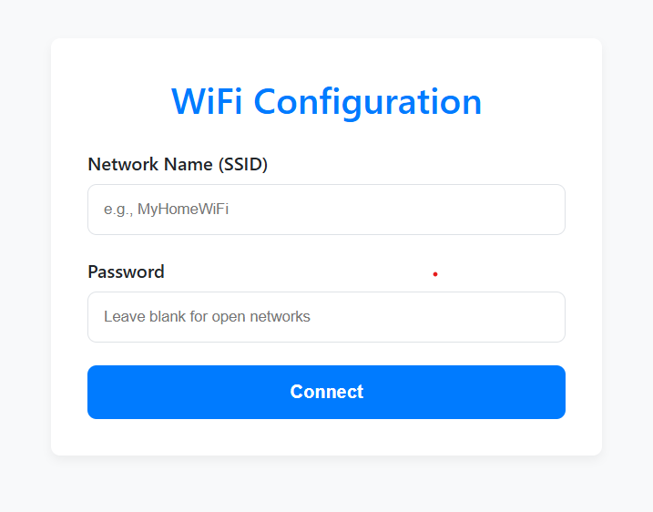

# ESP32 Wi-Fi Provisioning with C++ & ESP-IDF

A robust, object-oriented firmware for ESP32 enabling Wi-Fi connectivity and provisioning via a responsive web interface.

<p align="center">
  
  
  
</p>

-----

### 📖 Description

This project is an advanced ESP32 firmware for managing Wi-Fi connectivity using the ESP-IDF framework and FreeRTOS. It provides a web-based provisioning interface to configure Wi-Fi credentials, which are persistently stored using Non-Volatile Storage (NVS). The web assets are served from a dedicated LittleFS partition. The firmware is designed with a modular, object-oriented architecture for excellent scalability and maintainability.

### ✨ Showcase

Here is a showcase of the web provisioning page:
<p align="center">
  
</p>


### 🚀 Key Features

  * **Wi-Fi Provisioning:** Configure Wi-Fi credentials via a captive portal in Access Point (AP) mode.
  * **Wi-Fi Station Mode:** Automatically connects to a Wi-Fi network using stored credentials, with robust reconnection handling.
  * **Web Server:** Hosts a simple HTTP server for provisioning and remote reset functionality.
  * **LittleFS File System:** Stores the responsive web interface (`index.html`) in a dedicated `storage` partition.
  * **NVS Storage:** Persistently stores Wi-Fi credentials in the `storage` NVS namespace.
  * **OOP Architecture:** Logic is organized into `Application` and `WifiManager` classes for a clean separation of concerns.
  * **Centralized Configuration:** All key settings are defined in `include/config.h` for easy customization.

### 🛠️ Tech Stack & Requirements

#### Hardware

  * ESP32 Dev Module (or any compatible board).

#### Software

  * Visual Studio Code with the **PlatformIO** extension.
  * **ESP-IDF** v4.4 or newer (managed by PlatformIO).
  * **Git** for version control.

### 📋 Getting Started Guide

Follow these steps to set up, build, and run the project on your ESP32.

#### 1\. Clone the Project

Clone this repository to your local machine.

```bash
git clone https://github.com/your-username/esp-idf-wificonfiguration.git
cd esp-idf-wificonfiguration
```

#### 2\. Configure the Project

Review the settings in `include/config.h` and adjust them if necessary. The default settings are:

  * **AP SSID:** `ESP32-Provisioning`
  * **AP Password:** `password123`
  * **NVS Namespace:** `storage`
  * **LittleFS Partition Label:** `storage`
  * **LittleFS Base Path:** `/littlefs`

> **Note:** The partition label must match the name defined in your `partition_custom.csv` file.

#### 3\. Build and Upload

Flash the firmware and the filesystem to the ESP32 using a USB connection. This is a two-step process in PlatformIO.

1.  **Upload Filesystem Image:**
    This command compiles the `data` directory into a LittleFS image and flashes it to the device.

    ```bash
    pio run --target uploadfs
    ```

2.  **Upload Firmware:**
    This command compiles and uploads the main application code.

    ```bash
    pio run --target upload
    ```

> **Important:** You must run `uploadfs` first to ensure the `index.html` file is available on the device for the provisioning web interface.

#### 4\. Connect and Provision

After flashing, the ESP32 will start in provisioning mode if no Wi-Fi credentials are stored:

1.  Connect your phone or computer to the ESP32's Access Point (SSID: `ESP32-Provisioning`, Password: `password123`).
2.  Open a web browser and navigate to `http://192.168.4.1`.
3.  Enter your Wi-Fi network's SSID and password, then click **Connect**.
4.  The device will store the credentials and restart to connect to the specified network.

If the connection is successful, the ESP32 will operate in Station mode and log its new IP address to the serial monitor. To reset the device, navigate to `http://<ESP32-IP-ADDRESS>/reset`.

#### 5\. Monitor the Device

Use the PlatformIO Serial Monitor to view logs and check the device's status.

```bash
pio device monitor
```

### 🔍 Development & Testing Tips

  * **Provisioning Tests:** Connect to the AP and submit invalid credentials to verify error handling and the fallback to provisioning mode.
  * **File System Verification:** Ensure `index.html` is correctly uploaded. If the page doesn't load, check the serial monitor for "File not found" errors.


### 🙏 Acknowledgements

This project heavily relies on the excellent work of the **Jolt Wallet team** for creating and maintaining the [esp\_littlefs](https://github.com/joltwallet/esp_littlefs) library. Their effort in porting LittleFS to the ESP-IDF ecosystem is greatly appreciated and forms a core part of this firmware's storage functionality.


### 👤 Author

Developed and maintained by **Muhamad Arif Hidayat**.

### 📜 License

This project is licensed under the MIT License. See the `LICENSE` file for details.
